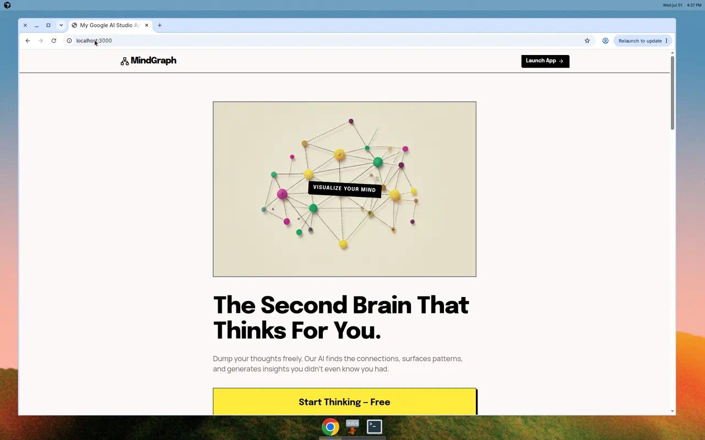
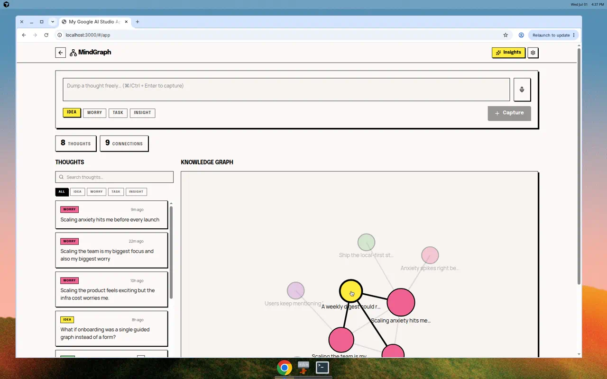
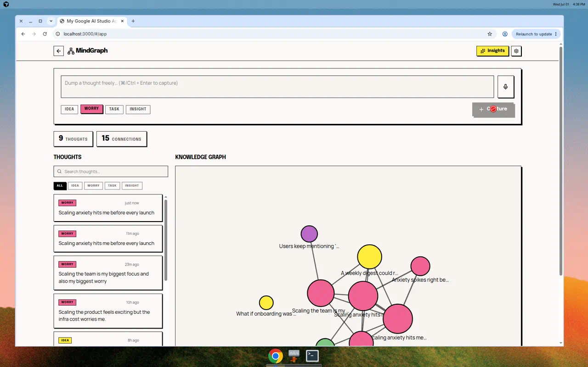
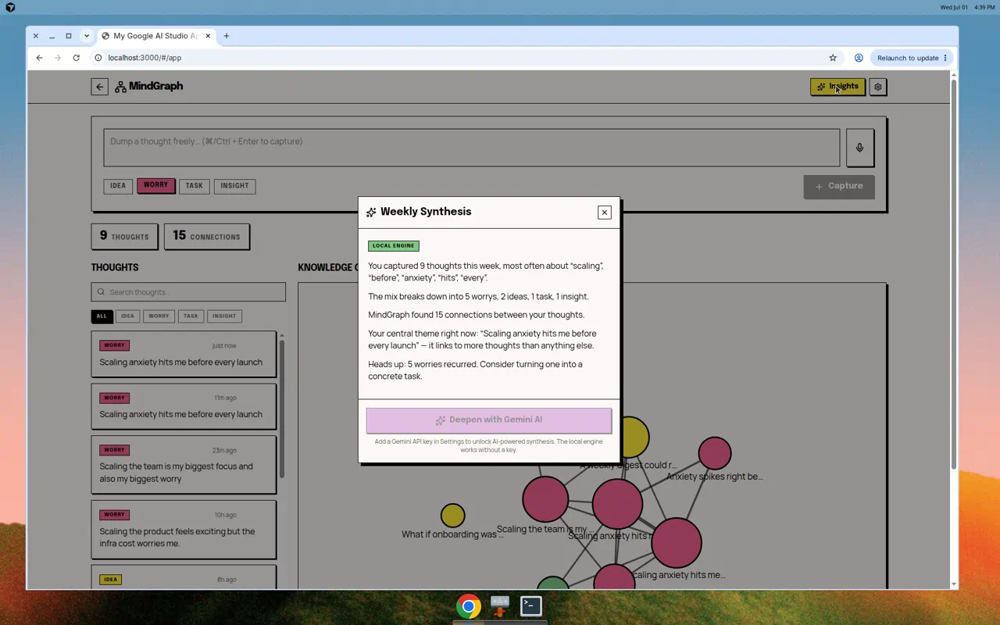
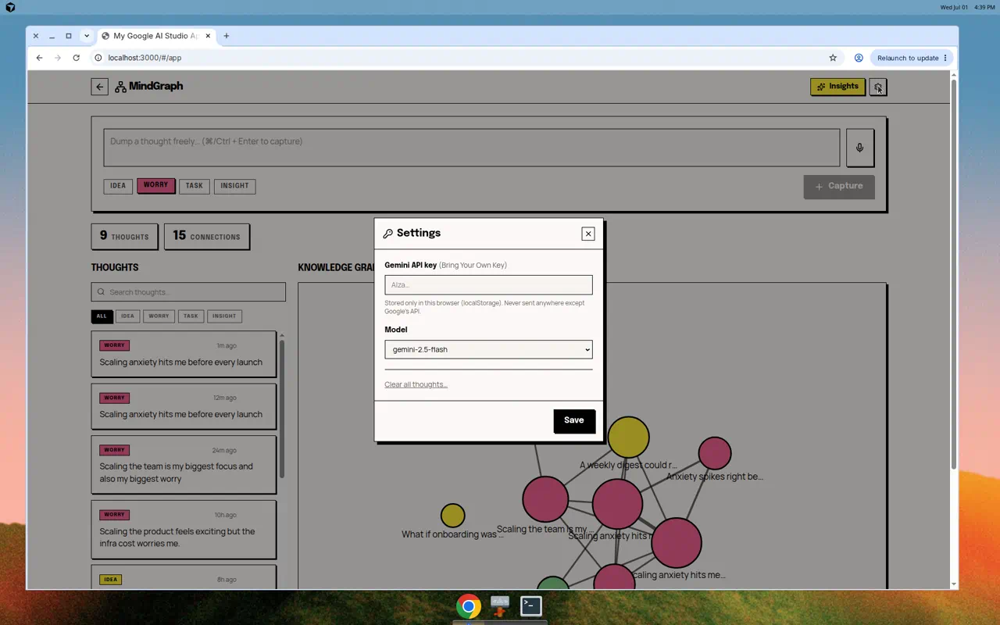

<div align="center">

# 🧠 MindGraph

### The second brain that thinks *with* you.

**MindGraph** is a local‑first knowledge graph for your thoughts. Dump ideas freely and it
automatically surfaces the connections between them, visualizes them as an interactive graph,
and generates weekly insights — all in your browser, with your data never leaving your device.

[](https://react.dev)
[](https://vite.dev)
[](https://www.typescriptlang.org)
[](#-install-as-an-app-pwa)
[](LICENSE)


</div>

---

## Table of contents

- [Why MindGraph](#why-mindgraph)
- [Features](#-features)
- [Screenshots](#-screenshots)
- [Tech stack](#-tech-stack)
- [Getting started](#-getting-started)
- [Usage guide](#-usage-guide)
- [Bring Your Own Key (AI)](#-bring-your-own-key-ai)
- [Install as an app (PWA)](#-install-as-an-app-pwa)
- [Deployment](#-deployment)
- [Project structure](#-project-structure)
- [How it works](#-how-it-works)
- [Roadmap](#-roadmap)
- [Contributing](#-contributing)
- [License](#-license)

---

## Why MindGraph

Traditional note apps make *you* do the filing — folders, tags, backlinks. MindGraph flips
that: you capture raw thoughts, and the app does the connecting. It is built on three
principles:

- **Local‑first** — everything is stored in your browser (`localStorage`). No account, no
  server, no tracking.
- **Private by default** — your notes never leave your device. AI features are opt‑in and use
  *your own* API key ("Bring Your Own Key").
- **Insight over storage** — the point isn't to store notes, it's to *reveal patterns* you
  didn't know were there.

## ✨ Features

- 📝 **Frictionless capture** — jot a thought, tag it as an *Idea*, *Worry*, *Task*, or
  *Insight*, and move on.
- 🕸️ **Automatic knowledge graph** — thoughts are linked by a keyword‑overlap engine and
  rendered as an interactive, force‑directed graph. Click any node to spotlight its links.
- 🔍 **Search & filter** — instantly find thoughts by text or type.
- ✅ **Task tracking** — mark *Task* thoughts as done.
- 🗣️ **Voice capture** — dictate thoughts with the Web Speech API ("Talk to your graph").
- 🪄 **Weekly Synthesis** — a one‑click report of your recurring themes and central ideas.
  Works fully offline, with an optional AI‑powered deep dive.
- 🔑 **Bring Your Own Key** — plug in a Google Gemini API key for richer AI synthesis. Stored
  only in your browser.
- 📱 **Installable PWA** — install to your desktop or phone home screen and use it offline.
- 🎨 **Bold, distraction‑free UI** — a neo‑brutalist design that stays out of your way.

## 📸 Screenshots

| Landing | Workspace & graph |
| --- | --- |
|  |  |

| Node connections | Capture a thought |
| --- | --- |
|  |  |

| Weekly Synthesis | Settings (BYOK) |
| --- | --- |
|  |  |

## 🛠 Tech stack

| Area | Choice |
| --- | --- |
| UI | [React 19](https://react.dev) |
| Language | [TypeScript](https://www.typescriptlang.org) |
| Build tool / dev server | [Vite 6](https://vite.dev) |
| Styling | [Tailwind CSS v4](https://tailwindcss.com) |
| Icons | [lucide-react](https://lucide.dev) |
| PWA | [vite-plugin-pwa](https://vite-pwa-org.netlify.app) (Workbox) |
| Optional AI | [@google/genai](https://www.npmjs.com/package/@google/genai) (Gemini) |
| Storage | Browser `localStorage` (no backend) |

## 🚀 Getting started

### Prerequisites

- [Node.js](https://nodejs.org) 18+ (20/22 recommended)
- npm (bundled with Node)

### Install & run

```bash
# 1. Clone
git clone https://github.com/totaleroom/mindgraph.git
cd mindgraph

# 2. Install dependencies
npm install

# 3. Start the dev server
npm run dev
```

Open **http://localhost:3000** in your browser. That's it — no configuration or API key is
required to use the app.

### npm scripts

| Script | What it does |
| --- | --- |
| `npm run dev` | Start the Vite dev server on port 3000 (hot reload). |
| `npm run build` | Type‑check‑free production build into `dist/` (includes the PWA service worker). |
| `npm run preview` | Serve the production build locally (use this to test PWA/offline). |
| `npm run lint` | Type‑check the project with `tsc --noEmit`. |
| `npm run clean` | Remove the `dist/` folder. |

> ℹ️ The PWA service worker only runs in a **production build**. To try install/offline
> locally, run `npm run build` then `npm run preview`.

## 📖 Usage guide

A quick tour — see [`docs/USAGE.md`](docs/USAGE.md) for the full guide.

1. **Launch the app.** From the landing page, click **Start Thinking — Free** (or open
   `/#/app` directly).
2. **Capture a thought.** Type in the box at the top, pick a type (*Idea / Worry / Task /
   Insight*), and hit **Capture** (or press `⌘/Ctrl + Enter`). Prefer talking? Hit the mic.
3. **Explore the graph.** Your thoughts appear as colored nodes on the right, linked by the
   topics they share. Click a node to highlight everything it connects to.
4. **Manage thoughts.** Use the list on the left to search, filter by type, edit, delete, or
   tick off tasks.
5. **Get insights.** Click **Insights** for a *Weekly Synthesis* of your themes and central
   ideas. It works offline; add a Gemini key to unlock the AI deep dive.
6. **Your data.** Everything lives in your browser. Clear it anytime from **Settings → Clear
   all thoughts**.

## 🔑 Bring Your Own Key (AI)

AI synthesis is **optional** — the local engine already generates useful reports. To enable
the Gemini‑powered deep dive:

1. Get a free API key from [Google AI Studio](https://aistudio.google.com/app/apikey).
2. In MindGraph, open **Settings** (gear icon) → paste the key into **Gemini API key** →
   choose a model → **Save**.
3. Open **Insights** and click **Deepen with Gemini AI**.

Your key is stored **only** in your browser's `localStorage` and is sent solely to Google's
API when you request a synthesis.

## 📱 Install as an app (PWA)

MindGraph is a Progressive Web App, so you can install it and use it offline once deployed
over HTTPS (or from `localhost`).

- **Desktop (Chrome/Edge):** click the **install** icon in the address bar, or menu →
  *Install MindGraph*.
- **Android (Chrome):** menu → *Add to Home screen* / *Install app*.
- **iOS (Safari):** Share → *Add to Home Screen*.

After installing it launches full‑screen with its own icon and works without a network
connection.

## ☁️ Deployment

MindGraph builds to a fully static bundle with a **relative base** and hash‑based routing, so
it runs on any static host with **no server configuration**. See
[`docs/DEPLOYMENT.md`](docs/DEPLOYMENT.md) for details.

<details>
<summary><strong>GitHub Pages (turnkey — included)</strong></summary>

A workflow is provided at [`.github/workflows/deploy.yml`](.github/workflows/deploy.yml).

1. Push/merge to `main`.
2. Repo **Settings → Pages → Build and deployment → Source: GitHub Actions**.
3. Every push to `main` publishes to `https://<user>.github.io/mindgraph/`.
</details>

<details>
<summary><strong>Netlify / Vercel / Cloudflare Pages</strong></summary>

Import the repo and use:
- **Build command:** `npm run build`
- **Publish/output directory:** `dist`
</details>

<details>
<summary><strong>Render (static site)</strong></summary>

- **Build command:** `npm run build`
- **Publish directory:** `dist`
</details>

<details>
<summary><strong>Any static host (manual)</strong></summary>

```bash
npm run build
# upload the contents of dist/ to your host
```
</details>

## 🗂 Project structure

```
mindgraph/
├── public/                 # Static assets + PWA icons (generated from icon.svg)
├── src/
│   ├── components/         # UI: CaptureBar, ThoughtList, ThoughtCard, Graph, modals
│   ├── hooks/              # useThoughts, useSettings, useHashRoute, useSpeech
│   ├── lib/                # storage, connections engine, insights, gemini client
│   ├── pages/             # Landing (marketing) + Workspace (the app)
│   ├── types.ts            # Shared data model
│   ├── App.tsx             # Hash router
│   ├── main.tsx            # React entry point
│   └── index.css           # Tailwind theme + design tokens
├── docs/                   # Documentation & screenshots
├── .github/workflows/      # GitHub Pages deploy workflow
├── vite.config.ts          # Vite + Tailwind + PWA config
└── index.html
```

## 🧩 How it works

- **Connection engine** ([`src/lib/connections.ts`](src/lib/connections.ts)) — each thought is
  reduced to a set of keywords; two thoughts are linked when their **overlap coefficient**
  (shared ÷ smaller set) clears a threshold. Fully deterministic and offline.
- **Graph layout** ([`src/components/Graph.tsx`](src/components/Graph.tsx)) — a small
  force‑directed simulation runs to a stable layout, seeded per thought id so it's stable
  across renders. Rendered as plain SVG.
- **Insights** ([`src/lib/insights.ts`](src/lib/insights.ts)) — a local heuristic summarizes
  theme frequency, type mix, and the most‑connected "hub" thought; the optional Gemini path
  ([`src/lib/gemini.ts`](src/lib/gemini.ts)) is dynamically imported so it never affects load
  time or offline use.

For a deeper dive, see [`docs/ARCHITECTURE.md`](docs/ARCHITECTURE.md).

## 🧭 Roadmap

- [ ] Export / import thoughts (JSON, Markdown)
- [ ] Embedding‑based semantic connections (beyond keyword overlap)
- [ ] Optional end‑to‑end‑encrypted multi‑device sync
- [ ] Richer PWA install UI with screenshots
- [ ] Keyboard‑driven command palette

## 🤝 Contributing

Contributions are welcome! Please read [`CONTRIBUTING.md`](CONTRIBUTING.md) for the dev
workflow, coding conventions, and how to open a pull request.

## 📄 License

Released under the [MIT License](LICENSE).
